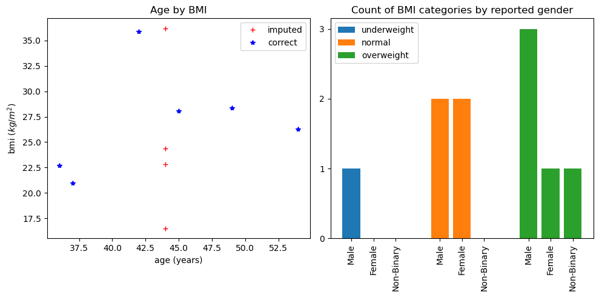

# Lab 3

My Figure:

My Table:
<table border="1" class="dataframe">
  <thead>
    <tr style="text-align: right;">
      <th></th>
      <th>email</th>
      <th>first_name</th>
      <th>last_name</th>
      <th>gender</th>
      <th>age</th>
      <th>height_cm</th>
      <th>weight_kg</th>
      <th>bmi</th>
      <th>issues</th>
    </tr>
  </thead>
  <tbody>
    <tr>
      <th>1</th>
      <td>sheldonwrightenzo@gmail.com</td>
      <td>Sheldon</td>
      <td>unknown</td>
      <td>m</td>
      <td>42</td>
      <td>191.00</td>
      <td>83</td>
      <td>22.8</td>
      <td>1</td>
    </tr>
    <tr>
      <th>2</th>
      <td>brennajonesxnph@yahoo.com</td>
      <td>Brenna</td>
      <td>Jones</td>
      <td>f</td>
      <td>42</td>
      <td>185.42</td>
      <td>84</td>
      <td>24.4</td>
      <td>1</td>
    </tr>
    <tr>
      <th>3</th>
      <td>jolenewallsqjkg@hotmail.com</td>
      <td>Jolene Sandoval</td>
      <td>Walls</td>
      <td>f</td>
      <td>37</td>
      <td>157.48</td>
      <td>52</td>
      <td>21.0</td>
      <td>1</td>
    </tr>
    <tr>
      <th>4</th>
      <td>tysonnealwzfg@gmail.com</td>
      <td>Tyson</td>
      <td>Neal</td>
      <td>m</td>
      <td>42</td>
      <td>179.00</td>
      <td>53</td>
      <td>16.5</td>
      <td>1</td>
    </tr>
    <tr>
      <th>7</th>
      <td>deonburkezfmw@hotmail.com</td>
      <td>Deon</td>
      <td>unknown</td>
      <td>m</td>
      <td>49</td>
      <td>179.00</td>
      <td>91</td>
      <td>28.4</td>
      <td>1</td>
    </tr>
  </tbody>
</table>

